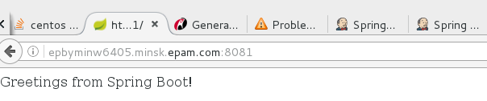
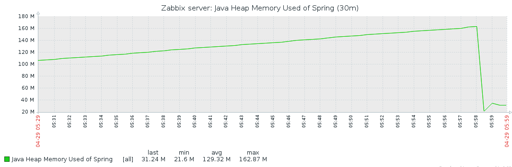
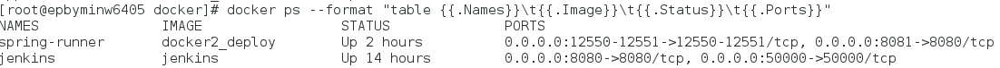
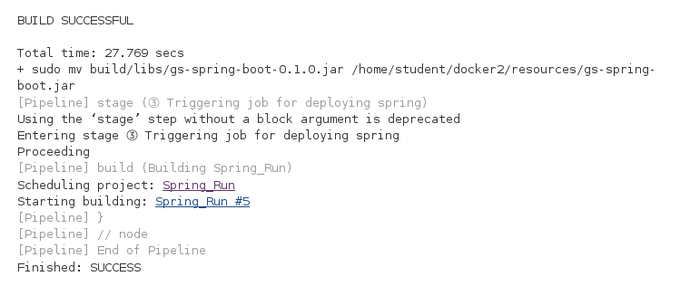

MTN.*NIX.11 Automated Environment Configuration Management
---

### DOCKER

- [Day 1](docker-1/)
- [Day 2](docker-2/)

Task2 Report Notes
---

### Deployed application

### Zabbix monitoring of Spring app Java heap memory used

### The result of 'docker ps -a' command

### Jenkins pipline: build job and deploy job

