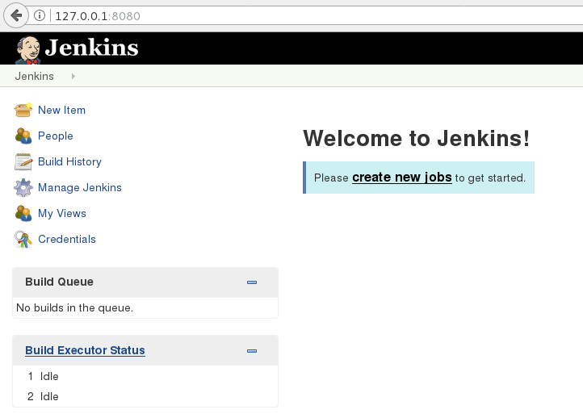
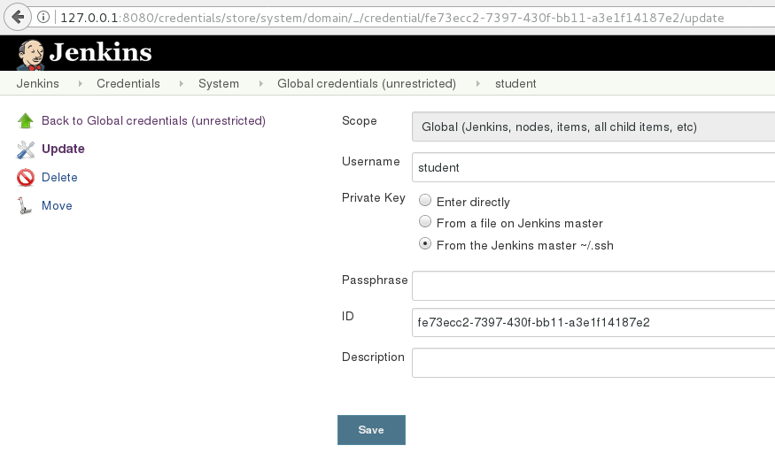

# Task:
1. Create custom ansible (v2.2.1) image

`docker build -t ansible -f ansible.Dockerfile .`

2. Launch Jenkins from [official image](https://hub.docker.com/_/jenkins/)

How to use this image

`docker run -d -p 8080:8080 -p 50000:50000 jenkins`

This will store the workspace in /var/jenkins_home. All Jenkins data lives in there - including plugins and configuration. You will probably want to make that a persistent volume (recommended):

`docker run -d -p 8080:8080 -p 50000:50000 -v /your/home:/var/jenkins_home jenkins`

or

`docker run --name myjenkins -d -p 8080:8080 -p 50000:50000 -v $(pwd)/jenkins_configs:/var/jenkins_home jenkins`

This will store the jenkins data in /your/home on the host. Ensure that /your/home is accessible by the jenkins user in container (jenkins user - uid 1000) or use -u some_other_user parameter with docker run.

You can also use a volume container:

`docker run --name myjenkins -d -p 8080:8080 -p 50000:50000 -v /var/jenkins_home jenkins`

Then myjenkins container has the volume (please do read about docker volume handling to find out more).




3. Link Docker Host as Jenknis slave (ssh)
4. Create custom gradle image
5. Configure a job to build [spring-boot application](https://spring.io/guides/gs/spring-boot/) using gradle image buit in 3
6. Configure a job to run just built Spring Boot app with docker-compose


### Example of usage docker to isolate toolset with its dependencies:

```
# what version?
$ docker run --rm sbeliakou/ansible:2.2.1 ansible --version

# run playbook from current dir
$ alias ansible-playbook='docker run --rm -v $(pwd):$(pwd) -w $(pwd) sbeliakou/ansible:2.2.1 ansible-playbook -vv'
$ ansible-playbook playbook.yml
```

### Using Docker in Jenkinsfile
[Jenkins Docker Pipeline plugin](https://go.cloudbees.com/docs/cloudbees-documentation/cje-user-guide/index.html#docker-workflow)

```
  stage('Run Tests') {
    try {
      dir('webapp') {
        sh "mvn test"
        docker.build("sbeliakou/my_container:${env.BUILD_NUMBER}").push()
      }
    } catch (error) {

    } finally {
      junit '**/target/surefire-reports/*.xml'
    }
  }
```