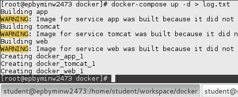
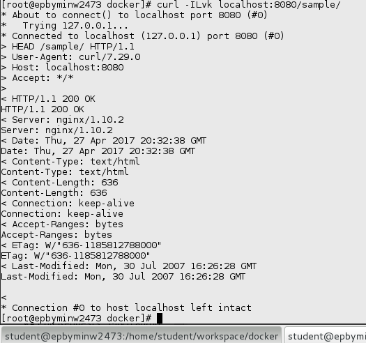
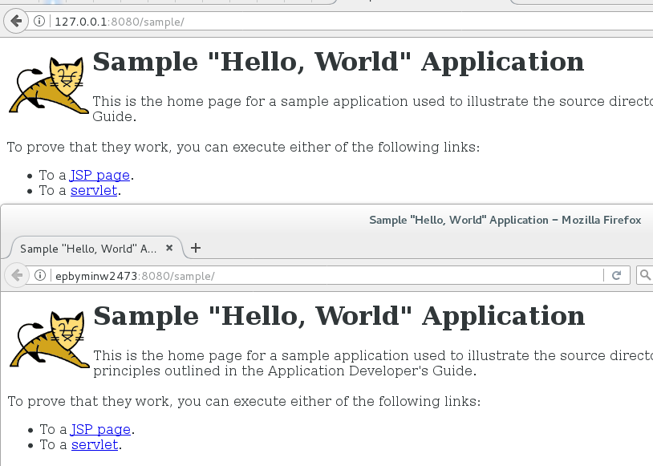

MTN.*NIX.11 Automated Environment Configuration Management
---

***Student***: Anton Cherlyonok

Home Task
---

Using base docker image ***sbeliakou/centos:7.2***

1. Wiht ```Dockerfiles```:
    - Create Docker Image of ```nginx``` ([web.Dockerfile](/web.Dockerfile))

    `docker build -t web -f web/web.Dockerfile .`

    - Create Docker Image of ```Tomcat 7``` ([tomcat.Dockerfile](/tomcat.Dockerfile))

    `docker build -t tomcat -f tomcat/tomcat.Dockerfile .`

    - Create Docker Image (Data Volume) with [```hello world```](https://tomcat.apache.org/tomcat-7.0-doc/appdev/sample/sample.war) application for Tomcat ([application.Dockerfile](application.Dockerfile))

    `docker build -t application -f application/application.Dockerfile .`

    - Run these Images so that [http://localhost/sample](http://localhost/sample) shows ```hello world``` page

    `docker run -d --name app application`

    `docker run -d --name tomcat --volumes-from app tomcat`


    - ```Nginx``` container forwards http requests to ```Tomcat``` container; Only ```nginx``` container exposes port (80)

    `docker run -d --name proxy -p 8080:80  --link tomcat web`

    `curl localhost:8080`

2. With ```docker-compose```:
    - Create ```docker-compose.yml``` file to build containers from previos task

    `pip install docker-compose`

    - Run "environment" in daemon mode

    `docker-compose up -d`

    
    
    


3. Create own branch (epam login without @epam.com, in lowercase)
4. Create PR with description of reported task
6. All needed resources (if they are) must be placed into ```/resources``` folder

Task Report Notes
---
*All stuff must be provided in this section
